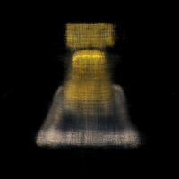
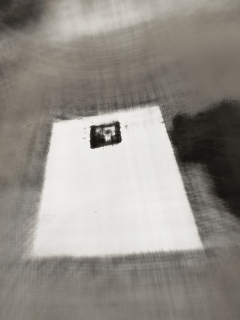

# CS 180 Project 4 — Neural Radiance Fields

Welcome to the repo that turns a pile of ArUco-tagged photos into neural fields, Lego renders, and a fully polished GitHub Pages report. This project follows the CS 180 NeRF assignment end‑to‑end: calibrating a real camera, collecting a custom dataset, warming up with 2D neural fields, then training two NeRFs (staff Lego + my own object) and packaging every deliverable into `website_stuff/` for painless publishing.

## Highlights

- 📸 **Capture pipeline**: calibration scripts (`calibrate_camera.py`, `estimate_pose.py`, `create_dataset.py`) that detect tags, solve for intrinsics/extrinsics, and pack everything into `nerf_dataset.npz`.
- 🧠 **Neural fields**: `part1_train.py` fits a single image via positional-encoded MLPs and logs training curves + hyperparameter grids.
- 🌈 **Double NeRF training**: `part2_train.py` drives both the Lego benchmark (`--train-lego`) and my custom dataset (`--train-custom`/`--resume`), saving intermediate renders, PSNR curves, loss logs, and GIFs.
- 🌐 **Shareable report**: `index.html` + `website_stuff/assets/**` form a GitHub Pages site with every required figure, GIF, and explanation in first-person past tense.

## Repository Tour

| Path | What lives there |
| --- | --- |
| `part1_train.py`, `part1_runs/` | 2D neural field trainer + stored progression renders, PSNR plots, and PE/width sweeps. |
| `part2_train.py`, `part2_runs*/` | NeRF trainer (custom + Lego modes) with resumable checkpoints, loss logs, renders, GIFs. |
| `calibrate_camera.py`, `estimate_pose.py`, `create_dataset.py` | Camera calibration, pose estimation, dataset packaging scripts. |
| `website_stuff/` | All public-facing assets (images, plots, gifs) mirrored out of ignored run folders so the site can be committed. |
| `index.html` | Standalone Bootstrap site ready for GitHub Pages. |

## Quick Start

```bash
# Create a venv and install deps (PyTorch, OpenCV, NumPy, viser, etc.)
python3 -m venv .venv && source .venv/bin/activate
pip install torch torchvision torchaudio opencv-python numpy matplotlib typer viser

# Fit a 2D neural field to an image (fox example)
python3 part1_train.py --image part1_files/fox.png --width 256 --pe-freq 10 --iters 2000

# Train the Lego NeRF (lightweight 800-step run)
python3 part2_train.py --dataset lego_200x200.npz --train-lego --lego-train-steps 800

# Resume custom-data NeRF training
python3 part2_train.py --train-custom --resume --custom-dataset nerf_dataset.npz --train-steps 900
```

## Publish the Website

All assets referenced by `index.html` already live inside `website_stuff/`, so GitHub Pages can serve the site directly from the repo root. To preview locally, just open `index.html` in a browser. To publish:

1. Commit `index.html` + `website_stuff/**`.
2. Push to GitHub.
3. Enable GitHub Pages → deploy from the `main` branch (root folder).

## Screenshots

| Lego NeRF progression | Custom orbit GIF |
| --- | --- |
|  |  |

Have fun exploring the code, tweaking hyperparameters, or swapping in your own object scans! If you spot something rough, open an issue or drop a PR. 🚀
